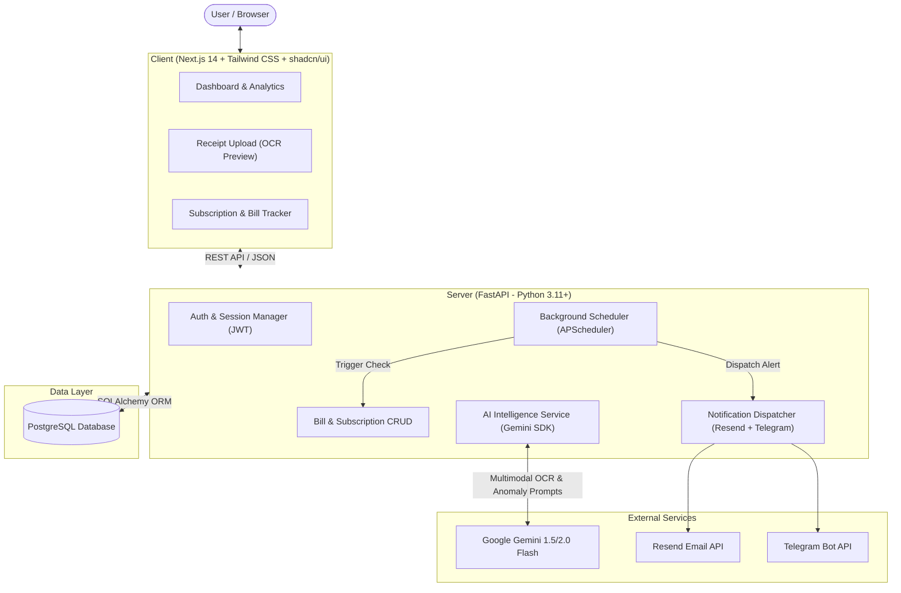

# 🛡️ BillGuard — AI-Powered Financial Guardian

[](https://nextjs.org/)
[](https://fastapi.tiangolo.com/)
[](https://www.postgresql.org/)
[](https://ai.google.dev/)
[](LICENSE)

> An intelligent, proactive financial assistant that consolidates recurring bills, tracks subscriptions, detects price hikes and hidden charges, and delivers timely payment alerts.

---

## 📌 Problem Statement

Managing multiple recurring financial commitments—such as electricity bills, internet plans, mobile recharges, SaaS/streaming subscriptions, insurance premiums, loan/EMI schedules, and rent—is fragmented and prone to human error. Manual tracking often results in:
- Missed payment deadlines and late penalty fees.
- Unnoticed price increases or silent renewal charges.
- Accumulation of "zombie" (unused) recurring subscriptions.
- Poor visibility into impending cash-flow crunches.

**BillGuard** goes beyond a passive bill ledger: it combines multimodal AI (document & receipt parsing) and automated background monitoring to actively protect users' financial health.

---

## ✨ Core Features

1. **Multimodal Bill & Receipt Ingestion**
   - Upload invoices, bills, or payment receipts as PDFs or images.
   - Google Gemini Flash extracts vendor name, due date, billing period, and total amount with high accuracy.
2. **Recurring Bill & Subscription Hub**
   - Centralized dashboard displaying all active commitments, renewal cycles, and category distributions.
3. **Smart Anomaly & Price-Hike Detection**
   - Identifies abnormal surges in variable bills (e.g., electricity spikes vs. previous month) and flags subscription cost updates.
4. **Automated Multi-Channel Notifications**
   - Timely reminders sent 7 days, 3 days, and 1 day before due dates via **Transactional Email** and **Telegram Bot**.
   - Calendar sync via downloadable `.ics` files.
5. **AI Financial Insights & Spending Forecasts**
   - Personalized financial summaries highlighting optimization opportunities and projected month-end obligations.

---

## 🏛️ System Architecture



---

## 👥 5-Member Team Roles & Responsibilities

| Role | Member | Primary Focus Area | Key Deliverables |
| :--- | :--- | :--- | :--- |
| **Team Lead & Full-Stack Architect** | **Member 1** | System Design, PR Reviews & Integration | Repo scaffolding, DB schemas, API contracts, integration testing, code review approval. |
| **Frontend & UI/UX Specialist** | **Member 2** | Next.js Client & Interactive Views | Dashboard layout, Bill table with filters, Add/Upload Bill modal, Recharts analytics, dark mode. |
| **Backend & Database Engineer** | **Member 3** | FastAPI Server, Database & CRUD | User Auth (JWT), CRUD APIs for bills/subscriptions, Alembic migrations, PostgreSQL indexing. |
| **AI & Intelligence Engineer** | **Member 4** | Gemini OCR & Financial Reasoning | Multimodal receipt parser endpoint, anomaly detection algorithm, AI monthly digest generator. |
| **Integrations, DevOps & QA Lead** | **Member 5** | Notifications, CI/CD & Deployments | Resend Email alerts, Telegram bot hooks, GitHub Actions CI workflows, Vercel & Render deployments. |

For detailed information on the technologies used, see [TECH_STACK.md](TECH_STACK.md).

---

## 🔄 GitHub Collaboration Guidelines

We maintain high code quality through a structured **GitHub Flow**:

1. **Branching Model**:
   - `main`: Production-ready code only.
   - `develop`: Staging and active sprint integration branch.
   - Feature branches: `feature/<member>-<feature-description>` (e.g., `feature/m2-dashboard-table`).
   - Bugfix branches: `fix/<member>-<bug-description>`.
2. **Pull Requests (PRs)**:
   - All PRs must target `develop`.
   - Require at least **1 review approval** before merging.
   - All automated CI checks must pass.
3. **Commit Messages**: Follow [Conventional Commits](https://www.conventionalcommits.org/):
   - `feat: add bill receipt upload endpoint`
   - `fix: resolve incorrect due date calculation in scheduler`
   - `docs: update setup instructions for Gemini API key`

---

## 🚀 Quickstart Guide

### Prerequisites
- [Node.js](https://nodejs.org/) (v20 or higher)
- [Python](https://www.python.org/) (v3.11 or higher)
- [PostgreSQL](https://www.postgresql.org/) (or Supabase / Neon connection string)
- [Google AI Studio API Key](https://aistudio.google.com/) for Gemini

### 1. Clone the Repository
```bash
git clone https://github.com/JoshualThomas/BillGuard.git
cd BillGuard
```

### 2. Backend Setup (FastAPI)
```bash
cd server
python -m venv venv
# On Windows:
.\venv\Scripts\activate
# On macOS/Linux:
# source venv/bin/activate

pip install -r requirements.txt
cp .env.example .env
# Fill in DATABASE_URL and GEMINI_API_KEY in .env

# Run database migrations & start development server
uvicorn app.main:app --reload --port 8000
```
API Documentation will be available at `http://localhost:8000/docs`.

### 3. Frontend Setup (Next.js)
```bash
cd ../client
npm install
cp .env.example .env.local
# Set NEXT_PUBLIC_API_URL=http://localhost:8000

npm run dev
```
Open `http://localhost:3000` in your browser.

---

## 🗺️ Project Milestones (4-Week Roadmap)

- [ ] **Sprint 1 (Week 1)**: Base scaffolding, database models, user auth, layout wireframes.
- [ ] **Sprint 2 (Week 2)**: Core bill and subscription management CRUD, dashboard metrics.
- [ ] **Sprint 3 (Week 3)**: Gemini multimodal receipt scanner, anomaly detection, alert dispatchers.
- [ ] **Sprint 4 (Week 4)**: Financial charts, notification triggers, automated tests, cloud deployment.

---

## 📄 License
This project is licensed under the MIT License - see the [LICENSE](LICENSE) file for details.
