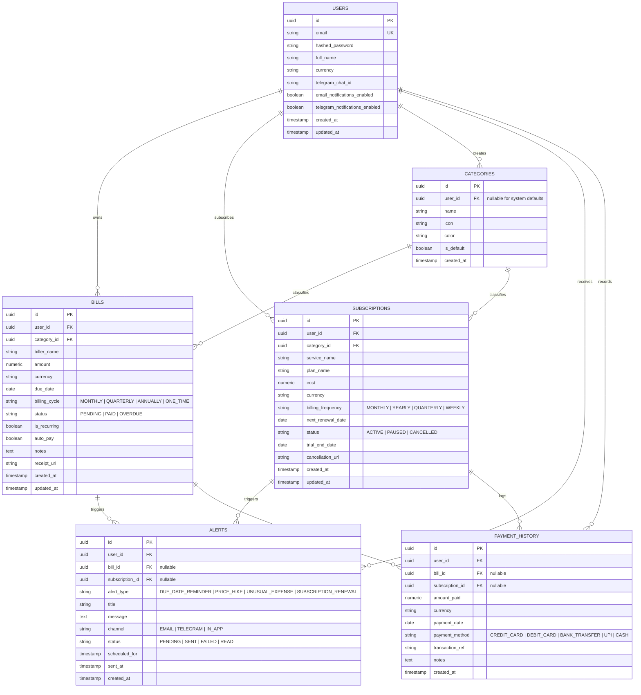

# 🗄️ BillGuard Database Schema & Entity Relationship Model

This document outlines the complete relational database schema for BillGuard, designed using **PostgreSQL 15+** with **SQLAlchemy 2.0**.

---

## 1. Entity Relationship (ER) Diagram



---

## 2. Table Specifications & Constraints

### 2.1 `users`
Represents application accounts.
- `id`: `UUID`, Primary Key, default `gen_random_uuid()`.
- `email`: `VARCHAR(255)`, Unique, Indexed, Non-null.
- `hashed_password`: `VARCHAR(255)`, Non-null.
- `full_name`: `VARCHAR(150)`, Non-null.
- `currency`: `VARCHAR(3)`, Default `'USD'`.
- `telegram_chat_id`: `VARCHAR(100)`, Nullable.
- `email_notifications_enabled`: `BOOLEAN`, Default `TRUE`.
- `telegram_notifications_enabled`: `BOOLEAN`, Default `FALSE`.
- `created_at`: `TIMESTAMPTZ`, Default `NOW()`.
- `updated_at`: `TIMESTAMPTZ`, Default `NOW()`.

### 2.2 `categories`
Categorization for expenses (e.g., Utilities, Streaming, Housing, Insurance, Subscriptions).
- `id`: `UUID`, Primary Key.
- `user_id`: `UUID`, Foreign Key referencing `users(id)`, ON DELETE CASCADE. Nullable if `is_default = TRUE`.
- `name`: `VARCHAR(80)`, Non-null.
- `icon`: `VARCHAR(50)`, Default `'folder'`.
- `color`: `VARCHAR(20)`, Default `'#6366F1'`.
- `is_default`: `BOOLEAN`, Default `FALSE`.

### 2.3 `bills`
Tracks recurring utility bills, EMIs, credit cards, and one-time bills.
- `id`: `UUID`, Primary Key.
- `user_id`: `UUID`, Foreign Key referencing `users(id)`, ON DELETE CASCADE, Indexed.
- `category_id`: `UUID`, Foreign Key referencing `categories(id)`, ON DELETE SET NULL.
- `biller_name`: `VARCHAR(150)`, Non-null, Indexed.
- `amount`: `NUMERIC(12, 2)`, Non-null.
- `currency`: `VARCHAR(3)`, Default `'USD'`.
- `due_date`: `DATE`, Non-null, Indexed.
- `billing_cycle`: `ENUM('MONTHLY', 'QUARTERLY', 'ANNUALLY', 'ONE_TIME')`.
- `status`: `ENUM('PENDING', 'PAID', 'OVERDUE')`, Default `'PENDING'`, Indexed.
- `is_recurring`: `BOOLEAN`, Default `TRUE`.
- `auto_pay`: `BOOLEAN`, Default `FALSE`.
- `notes`: `TEXT`, Nullable.
- `receipt_url`: `VARCHAR(500)`, Nullable.
- `created_at`: `TIMESTAMPTZ`, Default `NOW()`.
- `updated_at`: `TIMESTAMPTZ`, Default `NOW()`.

### 2.4 `subscriptions`
Tracks SaaS, streaming, memberships, and recurring services.
- `id`: `UUID`, Primary Key.
- `user_id`: `UUID`, Foreign Key referencing `users(id)`, ON DELETE CASCADE, Indexed.
- `category_id`: `UUID`, Foreign Key referencing `categories(id)`, ON DELETE SET NULL.
- `service_name`: `VARCHAR(150)`, Non-null.
- `plan_name`: `VARCHAR(100)`, Nullable (e.g., "Premium Family").
- `cost`: `NUMERIC(12, 2)`, Non-null.
- `currency`: `VARCHAR(3)`, Default `'USD'`.
- `billing_frequency`: `ENUM('MONTHLY', 'YEARLY', 'QUARTERLY', 'WEEKLY')`, Default `'MONTHLY'`.
- `next_renewal_date`: `DATE`, Non-null, Indexed.
- `status`: `ENUM('ACTIVE', 'PAUSED', 'CANCELLED')`, Default `'ACTIVE'`.
- `trial_end_date`: `DATE`, Nullable.
- `cancellation_url`: `VARCHAR(500)`, Nullable.

### 2.5 `alerts`
Tracks notification triggers for upcoming bills and AI-flagged price surges.
- `id`: `UUID`, Primary Key.
- `user_id`: `UUID`, Foreign Key referencing `users(id)`, ON DELETE CASCADE, Indexed.
- `bill_id`: `UUID`, Foreign Key referencing `bills(id)`, ON DELETE CASCADE, Nullable.
- `subscription_id`: `UUID`, Foreign Key referencing `subscriptions(id)`, ON DELETE CASCADE, Nullable.
- `alert_type`: `ENUM('DUE_DATE_REMINDER', 'PRICE_HIKE', 'UNUSUAL_EXPENSE', 'SUBSCRIPTION_RENEWAL')`.
- `title`: `VARCHAR(200)`, Non-null.
- `message`: `TEXT`, Non-null.
- `channel`: `ENUM('EMAIL', 'TELEGRAM', 'IN_APP')`.
- `status`: `ENUM('PENDING', 'SENT', 'FAILED', 'READ')`, Default `'PENDING'`.
- `scheduled_for`: `TIMESTAMPTZ`, Non-null, Indexed.
- `sent_at`: `TIMESTAMPTZ`, Nullable.

### 2.6 `payment_history`
Ledger of recorded payments for historical auditing and anomaly baseline comparison.
- `id`: `UUID`, Primary Key.
- `user_id`: `UUID`, Foreign Key referencing `users(id)`, ON DELETE CASCADE, Indexed.
- `bill_id`: `UUID`, Foreign Key referencing `bills(id)`, ON DELETE SET NULL, Nullable.
- `subscription_id`: `UUID`, Foreign Key referencing `subscriptions(id)`, ON DELETE SET NULL, Nullable.
- `amount_paid`: `NUMERIC(12, 2)`, Non-null.
- `currency`: `VARCHAR(3)`, Default `'USD'`.
- `payment_date`: `DATE`, Non-null, Indexed.
- `payment_method`: `ENUM('CREDIT_CARD', 'DEBIT_CARD', 'BANK_TRANSFER', 'UPI', 'CASH')`.
- `transaction_ref`: `VARCHAR(100)`, Nullable.
- `notes`: `TEXT`, Nullable.

---

## 3. Database Indexes

To guarantee sub-10ms response times for the frontend dashboard:
```sql
CREATE INDEX idx_bills_user_due ON bills (user_id, due_date, status);
CREATE INDEX idx_subscriptions_user_renewal ON subscriptions (user_id, next_renewal_date, status);
CREATE INDEX idx_alerts_pending_scan ON alerts (scheduled_for, status);
CREATE INDEX idx_payment_history_user_date ON payment_history (user_id, payment_date);
```
