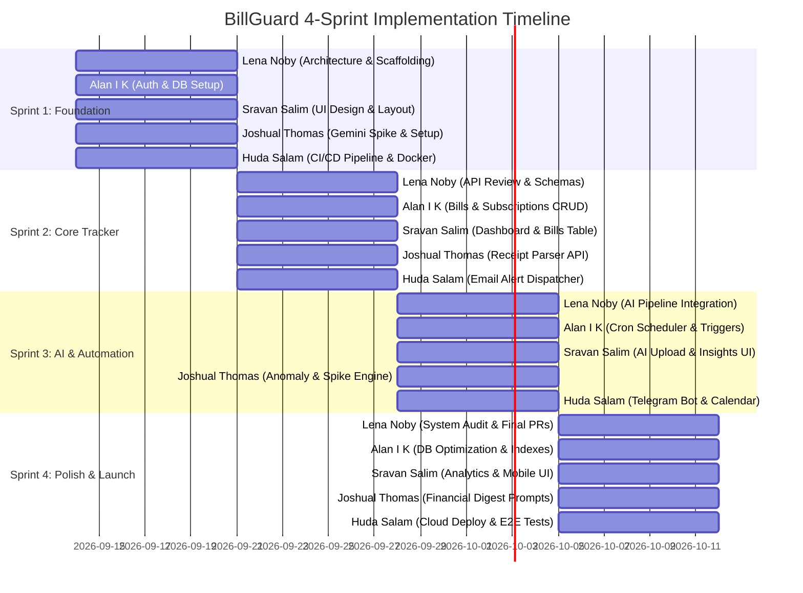

# 📅 BillGuard 4-Sprint Delivery Roadmap

This document serves as the team's sprint tracking plan across the 4 delivery cycles.

---

## Sprint 1: Foundation & Scaffolding

### 👑 Lena Noby (Team Lead & Full-Stack Architect)
- [x] Monorepo folder architecture (`client/` and `server/`).
- [x] Write `docs/DATABASE_SCHEMA.md` with complete ER diagram.
- [x] Write `docs/API_SPEC.md` OpenAPI contract specification.
- [x] Write `docs/SYSTEM_PROMPTS.md` for AI prompt engineering.
- [x] Implement core FastAPI setup with CORS and health endpoints.
- [x] Implement SQLAlchemy 2.0 async database session manager and Base model.
- [x] Create core Pydantic schemas for all entities.
- [x] Scaffold Next.js client with TypeScript, Tailwind, and utility libraries.

### 🎨 Sravan Salim (Frontend & UI/UX Specialist)
- [ ] Initialize shadcn/ui components (`button`, `card`, `dialog`, `badge`, `table`).
- [ ] Implement global navigation sidebar, responsive navbar, and theme toggle.
- [ ] Build static dashboard mockups with mock bill cards.

### ⚙️ Alan I K (Backend & Database Engineer)
- [ ] Setup PostgreSQL database connection via SQLAlchemy.
- [ ] Implement User authentication endpoints (`/auth/register`, `/auth/login`, `/auth/me`).
- [ ] Setup password hashing with bcrypt and JWT token issuing.

### 🤖 Joshual Thomas (AI & Intelligence Engineer)
- [ ] Setup Google Gemini API client credentials (`GEMINI_API_KEY`).
- [ ] Test zero-shot JSON extraction with sample bill images.
- [ ] Implement receipt validation schema.

### 🚀 Huda Salam (Integrations, DevOps & QA Lead)
- [ ] Configure `docker-compose.yml` for local PostgreSQL & Redis.
- [ ] Configure GitHub Actions workflow for backend & frontend CI.
- [ ] Create `.env.example` templates and test local Docker container boot.

---

## Sprint 2: Core Bill & Subscription Tracking

- **Lena Noby**: Review CRUD endpoints against API contract; validate frontend-to-backend data types.
- **Alan I K**: Implement `/bills` and `/subscriptions` CRUD endpoints with SQLAlchemy queries.
- **Sravan Salim**: Build interactive Bills & Subscriptions list with search, category filtering, and status badges.
- **Joshual Thomas**: Build file upload endpoint (`/ai/parse-receipt`) connecting FastAPI with Gemini Vision.
- **Huda Salam**: Integrate Resend email API to send confirmation emails upon bill creation.

---

## Sprint 3: AI Automation & Notifications

- **Lena Noby**: Integrate AI parsed receipt output with bill creation database persistence.
- **Alan I K**: Implement APScheduler background cron job checking for upcoming bills 7d, 3d, 1d ahead.
- **Sravan Salim**: Build "Upload Bill" modal with live preview of parsed AI fields (allow user edits before save).
- **Joshual Thomas**: Implement `/ai/anomalies` algorithm comparing current utility bills with historical averages.
- **Huda Salam**: Integrate Telegram Bot API to dispatch instant deadline alerts directly to user chats.

---

## Sprint 4: Analytics, Hardening & Deployment

- **Lena Noby**: Conduct end-to-end integration audit, code freeze, final demo script, and architectural presentation slides.
- **Alan I K**: Add database indexing, query performance tuning, and transaction rollback tests.
- **Sravan Salim**: Build interactive spending analytics charts (monthly trend line, category donut chart via Recharts).
- **Joshual Thomas**: Refine prompt outputs for financial digest; handle international currencies and receipt variations.
- **Huda Salam**: Deploy Next.js frontend to Vercel, deploy FastAPI backend to Render/Railway, configure production PostgreSQL on Supabase/Neon.
